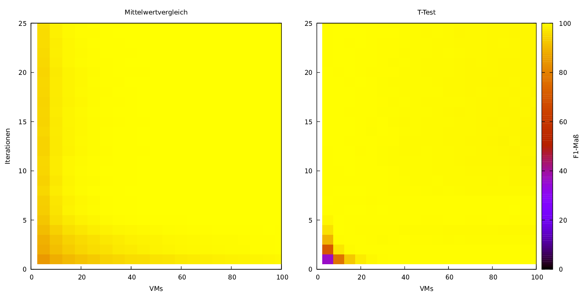

Precision Experiment
===================

The aim of this project is to determine a measurement method which is capable of distuingishing the performance of artificial unit tests. In general, performance tests for Java need multiple vm starts and in this multiple vm starts warmup executions, measurement executions and, if the testcase is small, which we consider as given, testcase repetitions. With this project, you can pick an arbitraty precission level and use experiments in order to determine how many executions are needed to reach this precision level. 

The artificial unit tests focus on addition and ram reservation. Unit tests for other purposes could be added. Experiments show that I/O behaves much different from the aforementioned workloads.

# Reusing Existing Measurements

If you got existing measurement results from a Peass run, you can use these to check when your performance change would have been reproduced. Therefore, build `precision-analysis` by executing `../gradlew fatJar` in this folder and execute `java -cp build/libs/precision-analysis-all-2.13.jar de.precision.analysis.repetitions.GeneratePeassPrecisionPlot -data $DATAFOLDER -slowVersionName $SLOWVERSION`. 

The data folder needs to be the `measurementsFull` folder of a peass execution. Afterwards, you will find precision data in each testcase folder, e.g. `$DATAFOLDER/measurements/$TESTCASE/results`. To plot these data, execute `cd scripts` and run `./createPeassHeatmap.sh $DATAFOLDER/measurements/$TESTCASE/results` for the `$TESTCASE` you want to visualize. Afterwards, you'll find heatmaps of your measurement in `peass_$TESTCASE`.

The result for the mean value comparison and T-Test might look like this: (converted with `convert -density 150 result_meanTTest.pdf -quality 90 result_meanTTest.png`)

# Test Execution

## Before all tests

These tests should be executed in an environment with as less parallel processes as possible, therefore we recommend to use a separate maschine for measurements. Furthermore, the CPU should not change its scaling. This can be achieved by running ./PrepareMeasurements on an ubuntu system.

It is assumed that tar and pxz for optimal compression of results are installed on the measurement maschine.

Optionally, you can control parameters of the tests by:
* changing src/test/java/de/confidence/Constants.java: Count of executions (At least 5000 is recommended, else you will only measure warmup)
* the environment variable VMS or changing the shell-skript that you are executing

## Comparing Coefficient of Variation

This shows, that the coefficient of variation is no proper indicator of reaching the steady state. Therefore, execute the following measurements on a suitable machine:

1. ./runCoefficientOfVariationMeasurement.sh on your measurement computer
2. Copy the results ~/.KoPeMe/default/ to your folder $RESULT.
3. Execute GenerateCoVPlot with $RESULT as parameter.
4. Switch to $RESULT and execute some of the printed commands, e.g. TODO. This shows, that 

TODO

# Comparing Different Repetition Counts

1. ./runRepetitions.sh on your measurement computer. Optionally, you can control the tested reptitions by changing the line ``for repititions in {10..100..20}`` in runRepetition.sh
2. Copy the results ~/.KoPeMe/default/ to your folder $RESULT.
3. Execute processing.repetitions.PlotPrecissions with $RESULT as parameter.
4. Run gnuplot and plot some of the given plot-recommendations. You could also combine them, like: 
  plot 'precission.csv' u 1:4 w lines title 'Precission ANOVA', 'precission.csv' u 1:5 w lines title 'Recall ANOVA', 'precission.csv' u 1:10 w lines title 'Precission Mann', 'precission.csv' u 1:11 w lines title 'Recall Mann','precission.csv' u 1:13 w lines title 'Precission Welch','precission.csv' u 1:14 w lines title 'Recall Welch'

# Compare Equal, but not Same Hardware Environments

The performance of unit tests in equal hardware and software environments differs due to production inaccuracies. In order to reproduce the measurements that prove that, do the following:

1. For every server: Start temperature logging ./get_temp.sh
2. For every server: Start the tests with ./runAddSimple.sh
3. Copy all results (temp.csv and ~/.KoPeMe/default/\*) to an location with gnuplot
4. Summarize the temperature: ./get_temp_avg.sh temp.csv (creates the average over 10 temperature measurements)
5. Assuming you have 3 folders server1, server2 and server3 containing measurements, plot temperature measurements in gnuplot with
	set datafile separator ';'
	plot 'server1/temp.csv_10_avg.csv'  u ($1-1503656419):($2/4) w lines title 'Server 1', 'server1/temp.csv_10_avg.csv' u ($1-1503656342):($2/4) w lines title 'Server 2', 'server1/temp.csv_10_avg.csv' u ($1-1503656526):($2/4) w lines title 'Server 3'
   You will recognize that the cpu temperature differs. In our measurements, it differed about 5%. 
6. Run the Java-Main CompareSameExecutions with the folder of your results. The output will contain the gnuplot-commands for plotting the individual plots, p.e.
	set datafile separator ';'
	set y2range [0:5]
	set y2tics
	set title 'Mean Mean and Mean Coefficient of Variation for de.addtest.Add1Test_0.addSomething'
	plot 'result_de.addtest.Add1Test_0_addSomething_all.csv' u ($0*200):1 title 'Mean', 'result_de.addtest.Add1Test_0_addSomething_all.csv' u ($0*200):2 title 'CoV' axes x1y2
  By combining them you can get an plot of all meaurements.

# Determining Parameters 

1. Prepare measurement parameters: Set EXECUTIONS in src/test/java/de/confidence/Constants.java to at least 5000, set the repetitions in ``for repititions in {10..100..20}`` and the vms in runRepetition.sh.
2. ./runRepetitions.sh on your measurement computer.
3. Copy the results ~/.KoPeMe/default/ to your folder $RESULT.
4. Execute de.precision.processing.repetitions.GeneratePrecisionPlot with $RESULT as parameter.
5. Run 
	cat precision.csv | awk '{if ($7>95.0 && $8>95.0) print $4+$5 ";" $0}' | sort -k1 -t ';' -n
The first line gives you the fastest configuration, where precission and recall are above 95%. 

# Funding

The creation of this project was funded by Hanns-Seidel-Stiftung (https://www.hss.de/).
